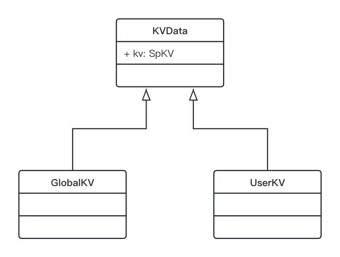

# KVWrapper

## 一、 概述
本项目演示了一套以kotlin委托属性为基础的key-value存储封装方案。 <br>
包含了基础类型，Set<String>, byte[], 对象，枚举，Map等类型的封装方法。 <br>

项目中是基于``SharePreferences``封装的，但这套方案也适用于其他类型的KV存储框架。<br>
例如 [FastKV](https://github.com/BillyWei01/FastKV) 的 [KVData](https://github.com/BillyWei01/FastKV/blob/main/app/src/main/java/io/fastkv/fastkvdemo/fastkv/kvdelegate/KVData.kt) 就是按照这套方案封装的。

## 二、 封装方法
封装过程包含 **基类定义** 和 **委托实现** 两部分。<br>
项目源码中已经实现了各种常用类型的定义，使用时复制粘贴即可。<br>
这里我们贴一下 **基类定义** 的代码。

### 2.1 方法封装

```kotlin
abstract class KVData {
    /**
     * 定义KV接口，由子类提供一个包含基本put/get方法的KV实现。
     */
    abstract val kv: SpKV

    // 基础类型
    protected fun boolean(key: String, defValue: Boolean = false) = BooleanProperty(key, defValue)
    protected fun int(key: String, defValue: Int = 0) = IntProperty(key, defValue)
    protected fun float(key: String, defValue: Float = 0f) = FloatProperty(key, defValue)
    protected fun long(key: String, defValue: Long = 0L) = LongProperty(key, defValue)
    protected fun double(key: String, defValue: Double = 0.0) = DoubleProperty(key, defValue)
    protected fun string(key: String, defValue: String = "") = StringProperty(key, defValue)
    protected fun array(key: String, defValue: ByteArray = EMPTY_ARRAY) = ObjectProperty(key, ArrayEncoder, defValue)

    // 内置的对象类型
    protected fun stringSet(key: String, defValue: Set<String>? = null) = StringSetProperty(key, defValue)

    // 自定义对象类型
    protected fun <T> obj(key: String, encoder: ObjectEncoder<T>, defValue: T? = null) = ObjectProperty(key, encoder, defValue)

    // 枚举类型
    protected fun <T> stringEnum(key: String, converter: StringEnumConverter<T>) = StringEnumProperty(key, converter)
    protected fun <T> intEnum(key: String, converter: IntEnumConverter<T>) = IntEnumProperty(key, converter)

    // Map类型
    protected fun combineKey(key: String) = CombineKeyProperty(key)
    protected fun string2String(key: String) = StringToStringProperty(key)
    protected fun string2Set(key: String) = StringToSetProperty(key)
    protected fun string2Int(key: String) = StringToIntProperty(key)
    protected fun string2Boolean(key: String) = StringToBooleanProperty(key)
    protected fun int2Boolean(key: String) = IntToBooleanProperty(key)
   
    // 可以按需扩展更多的类型
}
```

各种委托实现类类名比较长，我们在顶层基类封装一些名称简短的方法，以方面使用。


### 2.2 数据隔离

不同环境（开发环境/测试环境），不同用户，最好数据实例是分开的，相互不干扰。<br>
比方说有 uid='001' 和 uid='002' 两个用户的数据，如果需要隔离两者的数据，有多种方法，例如：

1. 拼接uid到key中。

    如果是在原始的``SharePreferences``的基础上，是比较好实现的，直接``put(key+uid, value)``即可； <br>
    但是如果用委托属性定义，则相对麻烦一些，因为通常用委托属性定义时，key需要时常量。<br>
    对于这种需要复合 **常量** + **变量** 的情况，可以用上面定义的Map类型的委托（其底层实现也是拼接key)。
2. 拼接uid到文件名中。

    但是不同用户的数据糅合到一个文件中，对性能多少有些影响：
    - 在多用户的情况下，实例的数据膨胀；
    - 每次访问value, 都需要拼接uid到key上。<br>
   
    因此，可以将不同用户的数据保存到不同的实例中。<br>
    具体的做法，就是拼接uid到路径或者文件名上。<br>
    对于``SharePreferences``来说，显然只能拼接uid到名字上了。

基于此分析，我们定义两种类型的基类：
- **GlobalKV**: 全局数据，切换环境和用户，不影响GlobalKV所访问的数据实例。
- **UserKV**: 用户数据，需要同时区分 “服务器环境“ 和 ”用户ID“。



```kotlin
/**
 * 全局数据
 */
open class GlobalKV(name: String) : KVData() {
    override val kv: SpKV by lazy {
        SpKV(name)
    }
}
```


```kotlin
/**
 * 用户数据存储
 */
abstract class UserKV(
    private val name: String,
    private val userId: Long
) : KVData() {
    override val kv: SpKV by lazy {
        val fileName = "${name}_${userId}_${AppContext.env.tag}"
        if (AppContext.debug) {
            SpKV(fileName)
        } else {
            // 如果是release包，可以对文件名做个md5，以便匿藏uid等信息
            SpKV(Utils.getMD5(fileName.toByteArray()))
        }
    }
}
```

## 三、 使用方法

数据类的定义，需根据数据的作用域，决定继承自 **GlobalKV** 还是 **UserKV**；<br>
然后就是声明变量：<br>
- 基本数据类型，传入key即可；
- 如果是枚举类型或者对象类型，需要传入转换接口的实现，毕竟底层的KV库只认得基本类型。

### 3.1 GlobalKV实例

```kotlin
/**
 * APP信息
 */
object AppState : GlobalKV("app_state") {
    // 服务器环境
    var environment by stringEnum("environment", Env.CONVERTER)

    // 用户ID
    var userId by long("user_id")

    // 设备ID
    var deviceId by string("device_id")
}

```

保存数据：
```kotlin
    AppState.userId = uid
```

读取数据：
```kotlin
   val uid = AppState.userId
```

### 3.2 UserKV实例

```kotlin
/**
 * 用户信息
 */
class UserInfo(uid: Long) : UserKV("user_info", uid) {
    companion object {
        private val map = ArrayMap<Long, UserInfo>()

        @Synchronized
        fun get(): UserInfo {
            return get(AppContext.uid)
        }

        @Synchronized
        fun get(uid: Long): UserInfo {
            return map.getOrPut(uid) {
                UserInfo(uid)
            }
        }
    }

    var userAccount by obj("user_account", AccountInfo.ENCODER)
    var gender by intEnum("gender", Gender.CONVERTER)
    var isVip by boolean("is_vip")
    var fansCount by int("fans_count")
    var score by float("score")
    var loginTime by long("login_time")
    var balance by double("balance")
    var sign by string("sing")
    var lock by array("lock")
    var tags by stringSet("tags")
    val favorites by string2Set("favorites")
    val config by combineKey("config")
}

```

``UserKV``的实例不能是单例（不同的``uid``对应不同的实例）。<br>
因此，可以定义``companion``对象，用来缓存实例，以及提供获取实例的API。<br>

然后声明变量的部分，和``GlobalKV``无异。<br>
需要注意的是：
- 基础类型，枚举类型，对象类型等，用``var``声明；
- Map类型，用``val``声明。

Map类型保存和读取方法如下：
```kotlin
UserInfo.get(uid).run {
    favorites["Android"] = setOf("A", "B", "C")
    favorites["iOS"] = setOf("D", "E", "F", "G")
}
```

```kotlin
UserInfo.get(uid).run {
    val androidFavorites = favorites["Android"]
    val iosFavorites = favorites["iOS"]
}
```

以上代码，使用上类似于Map访问value的语法，但底层其实是通过拼接key来实现的。<br>
比如``favorites["Android"]``，其传入底层的key是"favorites__Android"。 <br>

### 3.3 环境相关的实例
有一类数据，需要区分环境，但是和用户无关。<br>
这种情况，可以用``UserKV``, 然后``uid``传0（或者其他的uid用不到的数值）。

```kotlin
/**
 * 远程设置
 */
object RemoteSetting : UserKV("remote_setting", 0L) {
    /**
     * 某项功能的AB测试分组
     */
    val fun1ABTestGroup by int("fun1_ab_test_group")

    /**
     * 服务端下发的配置项
     */
    val setting by combineKey("setting")
}
```

## 四、 相关链接
掘金博客:
https://juejin.cn/post/7323449163420303370

FastKV:
https://juejin.cn/post/7018522454171582500


## License
See the [LICENSE](LICENSE) file for license rights and limitations.


